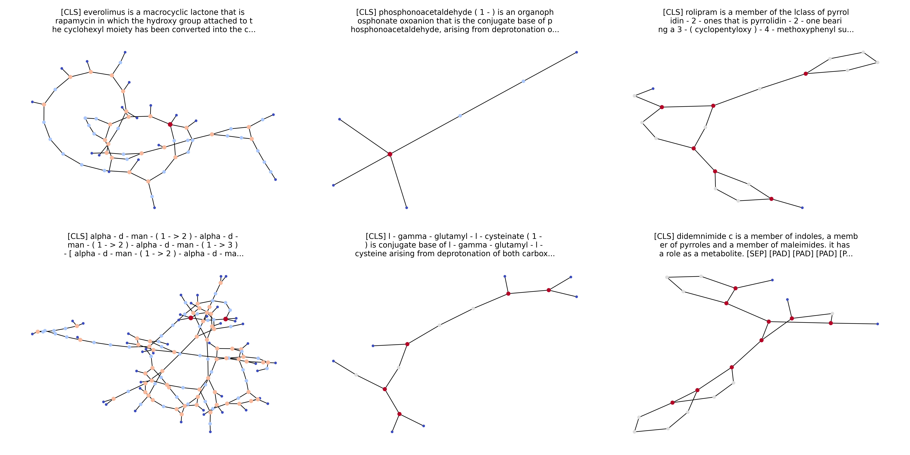

# Molecule Retrieval with Natural Language Queries

This repository contains my work for the challenge of the ALTEGRAD course at ENS Paris-Saclay. The goal of the challenge is to retrieve molecules from a database given a natural language query. The handout of the challenge can be found [here](./handout.pdf) and the challenge was hosted on [kaggle](https://www.kaggle.com/competitions/altegrad-2023-data-challenge).

  

## Data

The data is composed of a database of undirected graphs (molecules) with embeddings on each node (the embeddings are provided and are of dimension 300), and text descriptions of the molecules. The data is split into a training set containing 26408 examples, a validation set containing 3303 examples and a test set containing 3303 examples.

## Goal

The objective is to associate a molecule to each query. The evaluation metric is the label ranking average precision (LRAP), so we don't need to predict the molecule but only to rank them.

## Approach

The main idea is to use contrastive learning to encode the text and the graph in the same vector space. Then, we can use a similarity function to rank the molecules (generally the cosine similarity) based on their embeddings. In our case we separate the text and the graph in two different encoders, because each of these tasks is already complex enough. We use a pretrained language model to encode the text, and we used different graph neural networks to encode the graphs. The following graph neural networks were tested :
* Graph Convolutional Network (GCN)
* Graph Attention Network (GAT)
* Graph Transformers (Graphormer)
* Graph Sample and Aggregate (GraphSAGE)
* Path Neural Network (PathNN)

## Contributors

[@bastienlc](https://github.com/bastienlc),
[@s89ne](https://github.com/s89ne)
