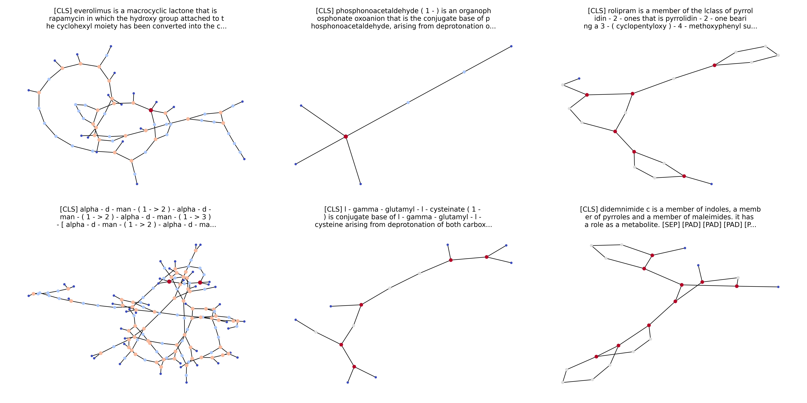

# Molecule Retrieval with Natural Language Queries

This repository contains our work for the challenge of the ALTEGRAD course at ENS Paris-Saclay where [@s89ne](https://github.com/s89ne) and I finished 6th out of about 50 teams with a score of 0.9422.

The goal of the challenge was to retrieve molecules from a database given natural language queries. The handout of the challenge can be found [here](./handout.pdf) and the challenge was hosted privately on kaggle.

  

This is a watered down version of our [original code](https://github.com/bastienlc/altegrad-challenge/tree/old) for the competition. We removed things that didn't work out for clarity.

## Approach

The main idea is to use contrastive learning to encode the text and the graph in the same vector space. Then, we can use a similarity function to rank the molecules based on their embeddings. Our approach can be summarized in the following steps:
1. Design a good graph neural network; in our case we used the GAT architecture.
2. Use this GNN in the DiffPool architecture to aggregate the nodes in a clever way.
3. Use an ensemble of such models to get a good score.

You can find our detailed report [here](./report/report.pdf).

## Reproducing our results

In the report, we present the following table (we only removed the diffpool-old model as it did not really bring anything to the table) :

| **Model name** | **DiffPool layers** | **MPL dimension** | **MPL** | **Linear layers**  | **Attention heads** | **Final linear layer** | **Graph parameters** | **Validation score** |
|-------------------------|------------------------------|-----------------------------------------|------------------|------------------------------------------|-------------------------------------------|---------------------------------|-------------------------------|-------------------------------|
| GAT                     | -                            | $1200$                                  | $3$              | $[1200, 600]$                            | $6$                                       | -                               | $8\:891\:784$                 | $0.6843$                      |
| Diffpool-deep           | $15, 10, 5, 1 $              | $600, 600, 600, 600$                    | $4, 3, 2, 2$     | $4\times[150, 150, 150]$                 | $4\times 3$                               | $700$                           | $14\:778\:965$                | $0.8367$                      |
| DiffPool-big            | $30, 10, 3, 1 $              | $300, 600, 1200, 1200$                  | 10, 5, 3, 1      | $[300], [600], [1200, 600], [1200, 600]$ | $3, 6, 12, 12$                            | $1200$                          | $35\:616\:428$                | $0.8430$                      |
| Diffpool-shallow        | $20, 3$                      | $2 \times 1200$                         | $4, 3$           | $2\times [150, 150, 150, 150]$           | $2\times 5$                               | $2000$                          | $34\:228\:057$                | $0.8462$                      |
| DiffPool-base           | $15, 5, 1 $                  | $3 \times 600$                          | $3, 3, 2$        | $3 \times [300]$                         | $3\times 3$                               | $1000$                          | $11\:454\: 805$               | $0.8515$                      |
| Diffpool-medium         | $15, 5, 1 $                  | $3 \times 600$                          | $6, 4, 3$        | $3\times [600, 300]$                     | $3\times 6$                               | $1200$                          | $20\:991\:405$                | $0.8716$                      |
| Diffpool-linear         | $15, 5, 1 $                  | $3 \times 600$                          | $4, 3, 2$        | $3\times [300, 300]$                     | $3\times 3$                               | $1200$                          | $13\:580\:805$                | $0.8804$                      |
| Diffpool-large          | $15, 5, 1 $                  | $3 \times 1200$                         | $5, 3, 2$        | $3\times [1200, 600]$                    | $3\times 6$                               | $1200$                          | $59\:116\:305$                | $0.8932$                      |

To reproduce our results, use the [train.py](./src/train.py) script to train the models. For each model in the above table, the correct hyper-parameters are set in the [ensembling.ipynb](./src/ensembling.ipynb) notebook. In our case, we used some of the models multiple times, but training each model once should be enough to get a good idea of the performance of the model. Once the models are trained, use the [ensembling.ipynb](./src/ensembling.ipynb) notebook to ensemble the models and get the final solution.

## Contributors

[@bastienlc](https://github.com/bastienlc),
[@s89ne](https://github.com/s89ne)
